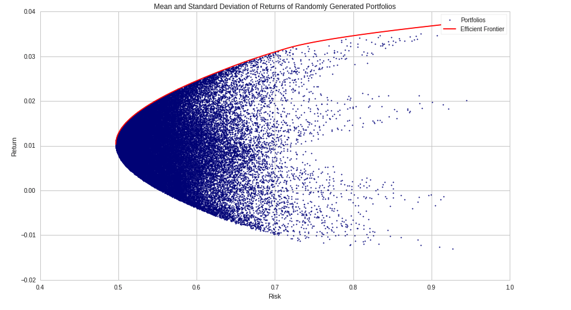

When constructing a portfolio via algorithm, it is frequently desirable to have a low correlation between the components of the portfolio, as that reduces risk from any single area. Similarly, it is best to have low correlation between the algorithms in the suite, as then one algorithm’s poor performance will not unduly hinder the total fund returns.

When taking an estimate or making an analysis, check it over time, as factors can falsely appear correlated at various times.

A basic strategy for a long-short portfolio is to rank a universe of stocks, then go long a selection of the top-ranked stocks and short a selection of the bottom-ranked stocks. This is a low-beta strategy, returns are in theory only determined by the quality of the ranking system. Test a ranking system by experiment by seeing if returns for the previous months were predictive of ranks for the next month, which will generate a p-value, with a null hypothesis that the rankings are not predictive. 

When developing a long-short trading strategy, the “strategy” that differs from portfolio to portfolio is the ranking method. The ranking method is where the trader inputs their hypothesis and market ideas into the strategy.

A trading universe should be as large as possible while completely excluding undesireable assets, such as stocks that are illiquid, too small, dififcult to trade, subject to restrictions, on the wrong exchange, or in any other way unsuitable for inclusion in the portfolio. A trading universe can change over time as stocks come onto and off of various exchanges or other changes happen.

Many trading algorithms have the following structure:

1. For each asset in a known (large) set, compute N scalar values for the asset based on a trailing window of data.
2. Select a smaller tradeable set of assets based on the values computed in (1).
3. Calculate desired portfolio weights on the set of assets selected in (2).
4. Place orders to move the algorithm’s current portfolio allocations to the desired weights computed in (3).

There are several technical challenges with doing this robustly. These include:

* efficiently querying large sets of assets
* performing computations on large sets of assets
* handling adjustments (splits and dividends)
* asset delistings

An alpha factor is a predictive relationship between a measure and some asset’s future returns.

The Capital Asset Pricing Model is a measure of the cost of capital. It assesses risk premium.

**Idiosyncratic risk** refers to risks that are firm-specific and can be diversified away, such as a management change or a faulty production

**Systematic risk** is market-wide and affects all market participants

As the number of assets in a portfolio increases, Idiosynratic risk decreases. Thus, in a portfolio each asset’s expected return should be the risk-free return plus that asset’s systematic risk premium, while the variation should be just that asset’s systematic risk variation.

GOAL: Find best portfolio at given risk level
---------------------------------------------

Each blue dot represents a different portfolio, while the red line skimming the outside of the cloud is the efficient frontier. The efficient frontier contains all portfolios that are the best for a given level of risk.

The optimal, or most efficient, portfolio on this line is found by maximizing the Sharpe ratio, the ratio of excess return and volatility. We use this to determine the portfolio with the best risk-to-reward tradeoff.

The line that represents the different combinations of a risk-free asset with a portfolio of risky assets is known as the Capital Allocations Line (CAL). The slope of the CAL is the Sharpe ratio. To maximize the Sharpe ratio, we need to find the steepest CAL, which coincides with the CAL that is tangential to the efficient frontier. This is why the efficient portfolio is sometimes referred to as the tangent portfolio.

The CAPM is a well-studied and useful model but does not do well in empirical tests. Arbitrage Pricing Theory generalized the CAPM to make it usable.